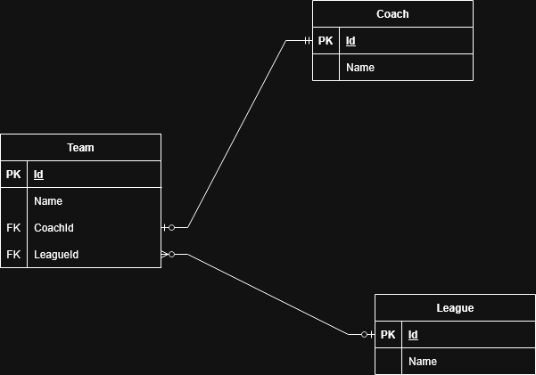

# EntityFrameworkCore Football League Solution



This solution demonstrates a football league management system using Entity Framework Core with a SQL Server backend. It includes projects for the domain models, data access, and a console application to interact with the database.

## Project Structure

- **EntityFrameworkCore.Domain**: Contains domain models such as `Team`, `Coach`, `League`, and `Match`.
- **EntityFrameworkCore.Data**: Contains the `FootballLeagueDbContext`, EF Core configurations, and migration files.
- **EntityFrameworkCore.Console**: Console app for interacting with the database using various EF Core queries.

## Prerequisites

- [.NET 8 SDK](https://dotnet.microsoft.com/download)
- [Docker](https://www.docker.com/products/docker-desktop)
- [SQL Server Docker Image](https://hub.docker.com/_/microsoft-mssql-server)

## Setting Up the Environment

### 1. Set the SQL Server SA Password with a .env File

The project now uses a `.env` file to provide environment variables, including the SQL Server `sa` user password.

1. Create a file named `.env` in the root of your project.
2. Add the following line, replacing `YourStrong!Passw0rd` with your desired password:
   ```
   DB_PASSWORD=YourStrong!Passw0rd
   ```
3. The Docker Compose setup and the application will automatically use this variable.

> **Note:** Do not commit your actual `.env` file with sensitive information to version control.

### 2. Start SQL Server with Docker Compose

From the root of the solution (where `docker-compose.yaml` is located), run:

```sh
docker compose up -d
```

This will start a SQL Server instance on port 1433.

### 3. Apply and List Entity Framework Core Migrations

Navigate to the solution root (where the `.sln` file is located), and use the following commands:

- **Apply Migrations:**  
  This command will create the database and apply all migrations from the `Migrations` folder:
  ```sh
  dotnet ef database update --project EntityFrameworkCore.Data --startup-project EntityFrameworkCore.Console
  ```

- **List Available Migrations:**  
  This command will show all migrations that have been added to your project:
  ```sh
  dotnet ef migrations list --project EntityFrameworkCore.Data --startup-project EntityFrameworkCore.Console
  ```

- `--project EntityFrameworkCore.Data` specifies the project containing your `DbContext` and migrations.
- `--startup-project EntityFrameworkCore.Console` specifies the executable project that configures your services and entry point.

> **Tip:** If you need to install the EF Core CLI tools, run:
> ```sh
> dotnet tool install --global dotnet-ef
> ```

### 4. Run the Console Application

Navigate to the `EntityFrameworkCore.Console` project and run:

```sh
cd EntityFrameworkCore.Console
dotnet run
```

This will execute the main program, which includes various EF Core queries and commands.

## Useful Commands

- **View running containers:**
  ```sh
  docker ps
  ```
- **Stop the SQL Server container:**
  ```sh
  docker compose stop
  ```

## Migrations

All migration files are located in [`EntityFrameworkCore.Data/Migrations`](EntityFrameworkCore.Data/Migrations). You can add new migrations from the root folder using:

```sh
dotnet ef migrations add MigrationName --project EntityFrameworkCore.Data --startup-project EntityFrameworkCore.Console
```

## License

This project is for educational purposes.

---

**Author:**  
Toka Thanos
